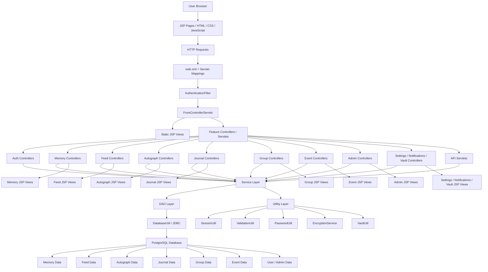

# System Architecture Diagram

## Everly System Architecture

## Main Layers

1. Presentation Layer
   Browser-based UI built with JSP, CSS, and JavaScript under `src/main/webapp/WEB-INF/views`.

2. Routing and Request Handling
   Requests pass through `web.xml`, `AuthenticationFilter`, and `FrontControllerServlet`, then go to the relevant feature servlet/controller.

3. Application Layer
   Business logic is handled by services in `src/main/java/com/demo/web/service`.

4. Data Access Layer
   DAO classes in `src/main/java/com/demo/web/dao` handle SQL and database operations through JDBC.

5. Data Layer
   PostgreSQL stores application data for users, memories, feed posts, autographs, journals, groups, events, admin data, and related records.

## Feature Modules Included

- Authentication
- Memories
- Feed
- Autographs
- Journals
- Groups
- Events
- Admin Panel
- Settings
- Notifications
- Vault
- API Endpoints

## Request Flow Summary

1. User interacts with a JSP page in the browser.
2. Request is mapped through `web.xml`.
3. `AuthenticationFilter` checks protected access.
4. `FrontControllerServlet` routes the request.
5. Feature controller/servlet handles the request.
6. Service layer applies business logic.
7. DAO layer performs database operations.
8. Response is returned to a JSP view or API response.
